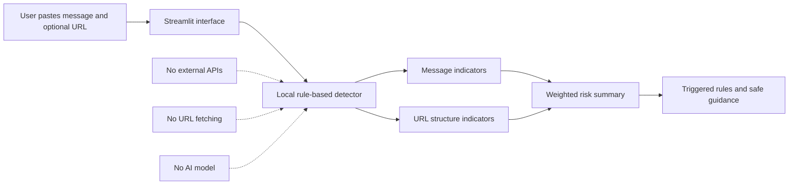

# Aegis Africa

Early-stage, rule-based cybersecurity prototype exploring suspicious-message and URL screening for African small businesses.


Aegis Africa is an early-stage product concept exploring affordable, mobile-first cybersecurity support for African small businesses. It began as a solo pitch for the Growth Summit 2026 Pitch Competition and is now being documented through a small Phase 0 prototype that screens pasted messages and URLs using transparent, defensive rules.

> **Educational prototype:** This repository is for technical exploration and product validation. It is not a deployed security service, not a fraud verdict system, and not a replacement for professional cybersecurity software.

## Current status

Aegis Africa began as a product concept developed for the Growth Summit 2026 Pitch Competition in March 2026, where it placed 4th. Development paused while I focused on academic projects and personal recovery. In August 2026, I returned to the idea by organizing the original research into this public repository and building an initial rule-based prototype. Aegis Africa is currently an early-stage concept and has not yet been deployed, validated with customers, or integrated with WhatsApp or financial platforms.

**Phase:** Phase 0 - documentation and rule-based prototype  
**Repository organized:** August 2026  
**Deployment status:** Not deployed  
**Customer validation:** Not completed  
**AI/ML status:** No trained AI or machine-learning model is included

## Project timeline

| Period | Confirmed activity |
|---|---|
| March 2026 | Aegis Africa was developed as a product concept and solo pitch for the Growth Summit 2026 Pitch Competition. |
| March 2026 | The pitch received 4th place. |
| After the competition | The concept was documented further. Some early outreach was mentioned by the founder, but publishable contact details and outcomes have not yet been verified for this repository. |
| Spring-Summer 2026 | Active development paused during academic work and a personal recovery period. |
| August 2026 | The public repository was organized and the Phase 0 rule-based prototype was created. |

See [PROJECT_TIMELINE.md](PROJECT_TIMELINE.md) for the fuller record.

## Competition recognition

A certificate reviewed during repository preparation confirms that Emmanuel Ihejiamaizu received **4th place in the Growth Summit 2026 Pitch Competition**, organized by Conestoga College's Google Developer Group, IT Club, and Conestoga Students Inc.

The original certificate and competition correspondence are not included in this repository to avoid publishing unnecessary personal or sensitive material. See [docs/competition-recognition.md](docs/competition-recognition.md).

## What the current prototype does

The Streamlit application lets a user:

- Paste a suspicious message.
- Optionally paste a URL.
- Run a local, deterministic risk assessment.
- See which message or URL indicators were triggered.
- Receive practical, defensive next-step guidance.
- Load synthetic examples for demonstration.

Configured indicators include requests for passwords or OTPs, changed payment details, urgent payment pressure, threats, possible impersonation, secrecy or off-channel requests, shortened URLs, raw IP addresses, punycode domains, and basic lookalike-style domain patterns.

## What it does not do

The prototype does **not**:

- Use an AI or machine-learning model.
- Visit, fetch, detonate, or scan a submitted URL.
- Query malware feeds, domain reputation services, DNS records, or financial platforms.
- Authenticate a sender or determine conclusively that content is safe or fraudulent.
- Connect to WhatsApp, email, banks, mobile-money services, or fintech platforms.
- Store a threat dataset or contain private customer messages.
- Represent a production-ready security control.

## Architecture



More detail is available in [docs/architecture.md](docs/architecture.md).

## Repository structure

```text
aegis-africa/
├── README.md
├── PROJECT_TIMELINE.md
├── requirements.txt
├── .gitignore
├── docs/
│   ├── problem-statement.md
│   ├── product-concept.md
│   ├── architecture.md
│   ├── mvp-roadmap.md
│   ├── market-discovery.md
│   ├── security-and-privacy.md
│   ├── competition-recognition.md
│   └── source-review.md
├── prototype/
│   ├── __init__.py
│   ├── app.py
│   ├── detector.py
│   └── sample_messages.py
├── tests/
│   └── test_detector.py
└── assets/
    └── README.md
```

## Install and run locally

### Requirements

- Python 3.10 or newer
- Git, if cloning from GitHub

### Windows PowerShell

```powershell
git clone https://github.com/chooksemmanuel/aegis-africa.git
cd aegis-africa

py -3.11 -m venv .venv
.\.venv\Scripts\Activate.ps1
python -m pip install --upgrade pip
pip install -r requirements.txt

python -m pytest
python -m streamlit run prototype/app.py
```

If PowerShell blocks virtual-environment activation, use this for the current terminal session and then activate again:

```powershell
Set-ExecutionPolicy -Scope Process -ExecutionPolicy Bypass
```

### macOS or Linux

```bash
git clone https://github.com/chooksemmanuel/aegis-africa.git
cd aegis-africa

python3 -m venv .venv
source .venv/bin/activate
python -m pip install --upgrade pip
pip install -r requirements.txt

python -m pytest
python -m streamlit run prototype/app.py
```

Streamlit should open the app in a local browser. Stop it with `Ctrl+C` in the terminal.

## Screenshots

Screenshots will be added after the first local run.

- `[Placeholder]` Empty input screen
- `[Placeholder]` High-risk synthetic example with triggered indicators
- `[Placeholder]` Low-risk synthetic example

See [assets/README.md](assets/README.md) for suggested filenames and privacy checks.

## Detection approach

The detector uses explainable regular expressions and URL-structure checks. Each triggered rule contributes a fixed weight to a score capped at 100. The score is grouped into three educational categories:

- **Low:** Few or no configured indicators were detected. This does not prove safety.
- **Caution:** One or more warning signs require independent verification.
- **High:** Multiple indicators suggest that the content should not be trusted without verification.

This scoring is heuristic. It has not been calibrated against a representative dataset and should not be presented as an accuracy-tested model.

## Limitations

- Rules can miss sophisticated scams and can flag legitimate messages.
- Language coverage is limited and has not been tested across African languages or regional writing styles.
- Domain checks are structural only and do not confirm ownership or reputation.
- The current weights and thresholds are design choices, not validated detection metrics.
- The prototype has no authentication, persistent storage, monitoring, or production hardening.
- Statistics and market-size claims from the March 2026 pitch remain subject to source verification before reuse.

## Security and privacy

- The detector makes no outbound network request.
- Submitted content is processed in memory by the running application.
- No application-level input logging or database storage is implemented.
- Only synthetic examples are included in the repository.
- Users should not paste confidential customer data, credentials, financial information, or private communications into a hosted copy without an approved data-handling process.
- A future hosted version would require a privacy review, retention policy, consent model, abuse controls, secure logging decisions, and incident-response process.

Read [docs/security-and-privacy.md](docs/security-and-privacy.md) before extending or deploying the prototype.

## Roadmap

### Phase 0 - current

- Document the original concept and its boundaries.
- Build a rule-based message and URL screening prototype.
- Create synthetic tests.
- Record unsupported pitch claims that require verification.

### Phase 1 - problem validation

- Conduct structured interviews with African small-business owners.
- Identify common scam categories, business workflows, and verification habits.
- Refine the target user and primary use case.
- Record evidence without publishing personal contact details.

### Phase 2 - limited MVP

- Build a limited MVP around the validated primary use case.
- Explore the official WhatsApp Business Platform only after confirming feasibility and policy requirements.
- Establish secure data-handling, consent, retention, and deletion processes.
- Measure detection accuracy, false positives, and user comprehension using consented test data.

### Phase 3 - evidence-led evaluation

- Collect properly consented and anonymized regional threat examples.
- Evaluate whether machine learning adds measurable value over transparent rules.
- Explore pilot partnerships only after validation and technical safeguards are in place.

See [docs/mvp-roadmap.md](docs/mvp-roadmap.md).

## Market discovery status

No named contacts, completed interviews, quotations, or market findings are published in this initial repository because the necessary details have not yet been verified. A structured evidence template is available in [docs/market-discovery.md](docs/market-discovery.md).

## Source review and claim controls

The original March 2026 proposal and pitch materials contain strong product, market, competitive, pricing, and AI claims written for a competition setting. The repository intentionally separates the **pitch vision** from the **current implementation**. See [docs/source-review.md](docs/source-review.md) for the claims that were retained, reframed, or withheld.

## Publishing to the existing empty GitHub repository

From the folder containing these files:

```powershell
git init
git branch -M main
git add .
git commit -m "Add Phase 0 rule-based prototype and project documentation"
git remote add origin https://github.com/chooksemmanuel/aegis-africa.git
git push -u origin main
```

If `origin` already exists:

```powershell
git remote set-url origin https://github.com/chooksemmanuel/aegis-africa.git
git push -u origin main
```

Do not add the private pitch documents, competition emails, contact lists, secrets, or API keys to the public repository.

## Licensing

No open-source licence has been selected. Unless and until a licence is added, normal copyright restrictions apply. External reuse, modification, or redistribution permissions have not been granted through this repository.

## Disclaimer

Aegis Africa is an early educational and product-validation prototype. The current application provides heuristic warnings only. It does not provide professional cybersecurity, legal, financial, or fraud-recovery advice, and it should not be relied on as the sole basis for a security or payment decision.

