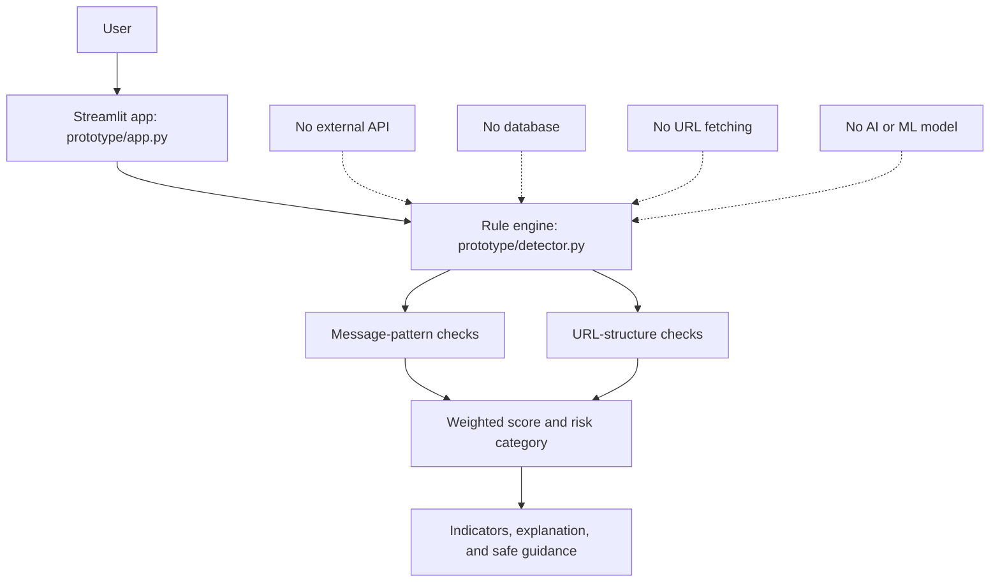
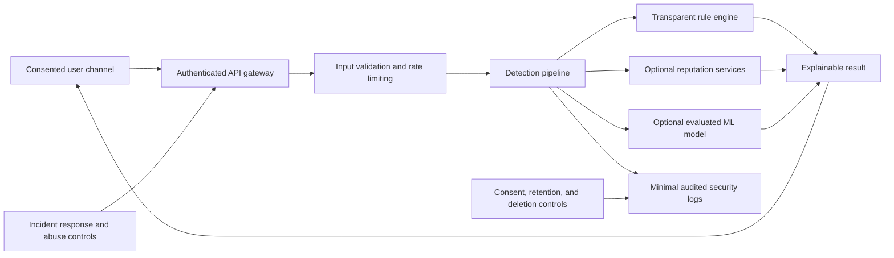

# Architecture

## Phase 0 architecture

The Phase 0 prototype is intentionally local and simple.

## Component responsibilities

### `prototype/app.py`

- Collects message text and an optional URL.
- Loads synthetic demonstration examples.
- Calls the detector and renders results.
- Handles expected validation errors and a generic unexpected-error state.
- Displays the educational-prototype disclaimer.

### `prototype/detector.py`

- Normalizes inputs.
- Extracts visible HTTP-style URLs from message text.
- Applies deterministic message and URL rules.
- Deduplicates indicators.
- Calculates a capped heuristic score.
- Produces risk wording and defensive guidance.

### `prototype/sample_messages.py`

- Contains fictional examples only.
- Provides no real customer, contact, or incident data.

### `tests/test_detector.py`

- Tests core rule behavior and input boundaries.
- Makes no network calls.

## Data flow and storage

The application processes inputs in memory. The repository does not implement a database, file-based input archive, analytics event, or application-level message log. A person deploying the app must still review hosting, reverse-proxy, platform, and infrastructure logs before making a privacy statement.

## Proposed future architecture - not implemented

This future design is a planning sketch only. Each external service, data store, and platform integration would require security, privacy, legal, reliability, cost, and policy review.
